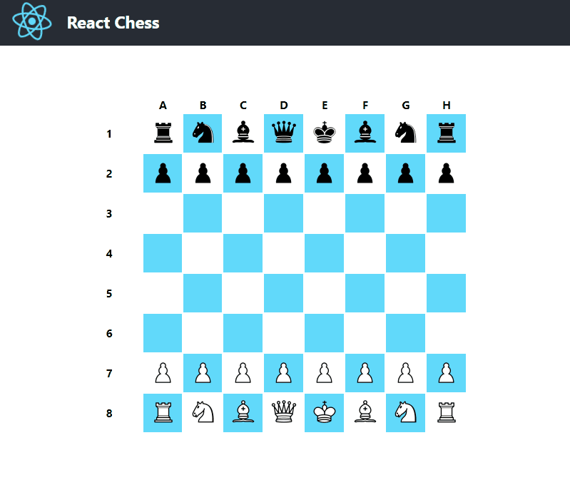

## React Chess

The purpose of this project is to develop a chess game with as little third party libraries as possible. 
It is a React project, so ideally React should be the only frontend dependency.
In reality some third party libraries would have made this easier.

#### GitHub Pages Link
- [https://nickdehart.github.io/ReactChess/](https://nickdehart.github.io/ReactChess/)

#### TODO:

- Tests!
- Logic impovements.
- Check and Checkmate states.
- UI improvements.
- Undo last move.

<!--  -->
